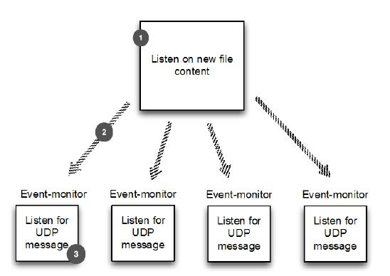

UDP 示例
====

我们的示例应用程序将打开一个文件，将每一行作为消息通过 UDP 发到指定的端口。如果你熟悉类 UNIX 操作系统,可以认为这是一个非常标准的简化版本 “syslog（系统日志）”。“UDP ，是一个完美的适合这样的应用程序，因为偶尔丢失一行日志文件可以被容忍,因为文件本身存储在文件系统中。此外,应用程序提供了非常有价值的能力有效地处理大量的数据。

UDP 广播使添加新事件“监视器”接收日志消息一样简单开始一个指定的端口上侦听器程序。然而,这种轻松的访问也提出了一个潜在的安全问题,指出为什么 UD P广播往往是在安全的环境中使用。还要注意广播消息可能只能在本地网络,因为路由器经常阻止他们。

*Publish/Subscribe（发布/订阅）*

应用程序，如 syslog 通常归类为“发布/订阅”;生产者或服务发布事件和多个订阅者可以收到它们。

整体看下这个应用，如下图：

1. 应用监听新文件内容
2. 事件通过 UDP 广播
3. 事件监视器监听并显示内容

Figure 13.1 Application overview

应用程序有两个组件:广播器和监视器或(可能有多个实例)。为了简单起见我们不会添加身份验证、验证、加密。

在下一节中我们将开始探索实现中,我们还将讨论 UDP 和 TCP 应用程序开发之间的差异。

